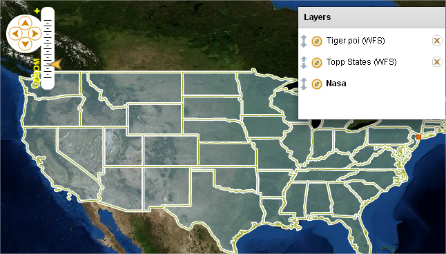

Introduction
============

This is the documentation for OpenScales. It has been created to help you to build OpenScales based applications.

`OpenScales <http://openscales.org>`_ is a Open Source (LGPL) mapping framework based on ActionScript 3 and Flex. It has been designed for building Rich Internet Mapping Applications easily.

History
-------

OpenScales has been initially started from `FlexLayers <http://code.google.com/p/flexlayers/>`_ source code, donated by Scott Pezanowski. FlexLayers was a Flex port of `OpenLayers <http://openlayers.org>`_. Since the beginning, the codebase has been extensively modified and improved. Nevertheless, even if OpenScales API is not strictly equivalent to OpenLayers one, if you have ever developed on OpenLayers, you will find OpenScales API quite easy to understand.

Features
--------

Here is a list of main OpenScales features :

* Support different kinds of layers
* OGC protocols : WMS/WMS-C 1.1.1, WFS 1.0, GetCapabilities support
* Optimized pure ActionScript 3 core (100 Kbytes)
* Flex 4 support built on top of the AS3 core
* Drawing
* Fast vector rendering
* Powerful Style API
* Popup support
* Tweening effect for pan, zoom and tiles
* XML runtime configuration to get dynamic maps from a single SWF compiled application
* Powerful controls and handlers to help you to build your app !

Platforms
---------

OpenScales have been designed to to run on all kind of devices :

* Mobile (ActionScript 3) : tested on Android Flash 10.1 player. It runs on HTC Desire at the same speed than on desktop.
* Web (Flex) : OpenScales 1.2 run on Flash 10 players, targeting 98% of current web browsers under Windows, Mac and Linux
* Desktop (AIR) : desktop mapping application based on OpenScales and AIR could be useful to manage offline mode, open local files like shapefiles, etc.

