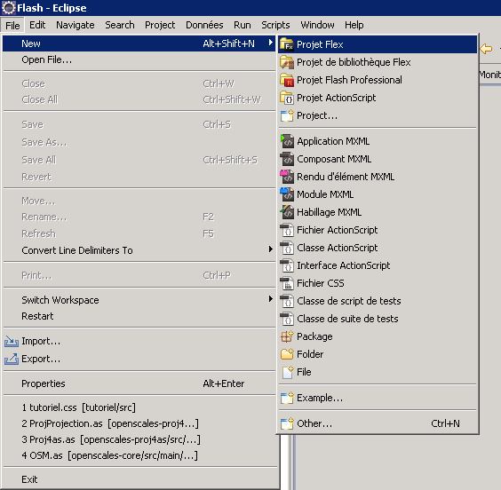
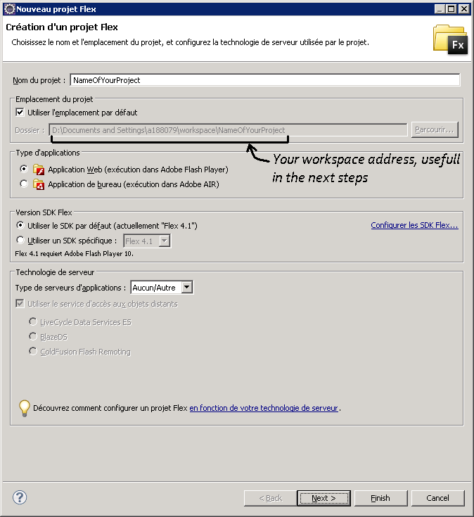
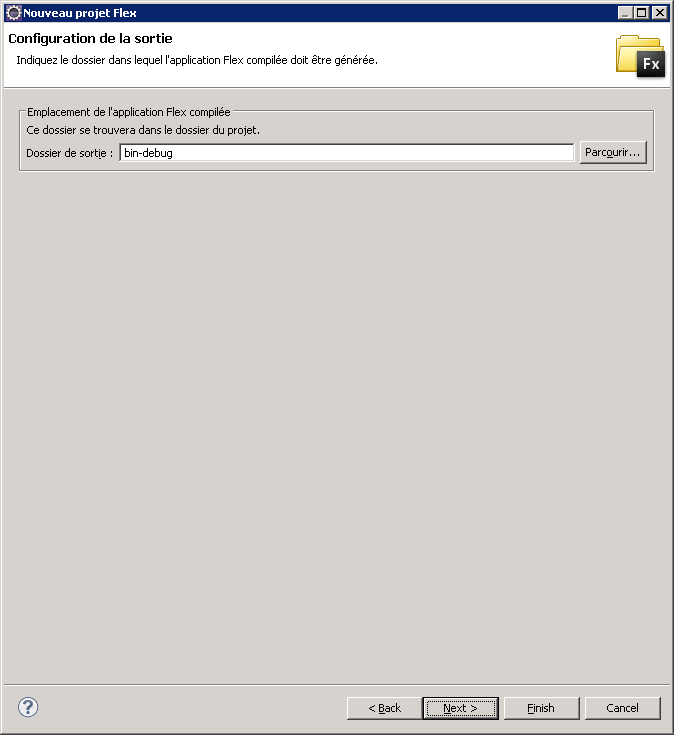
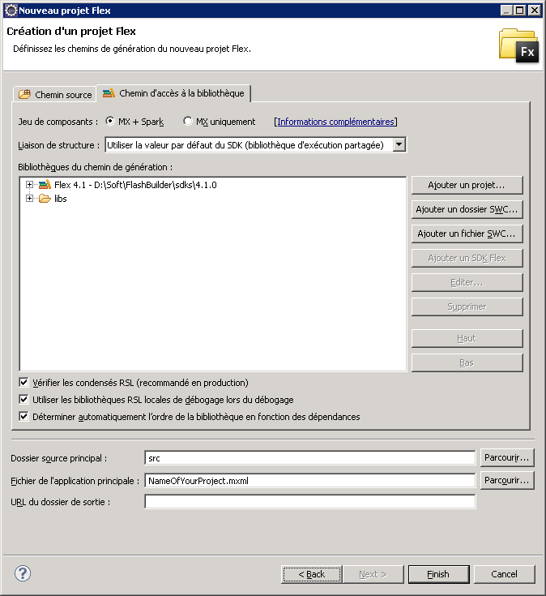
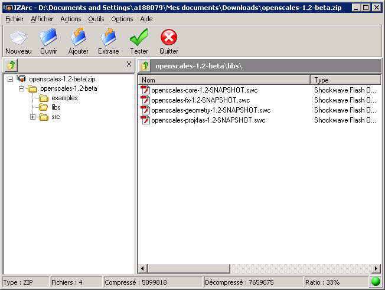
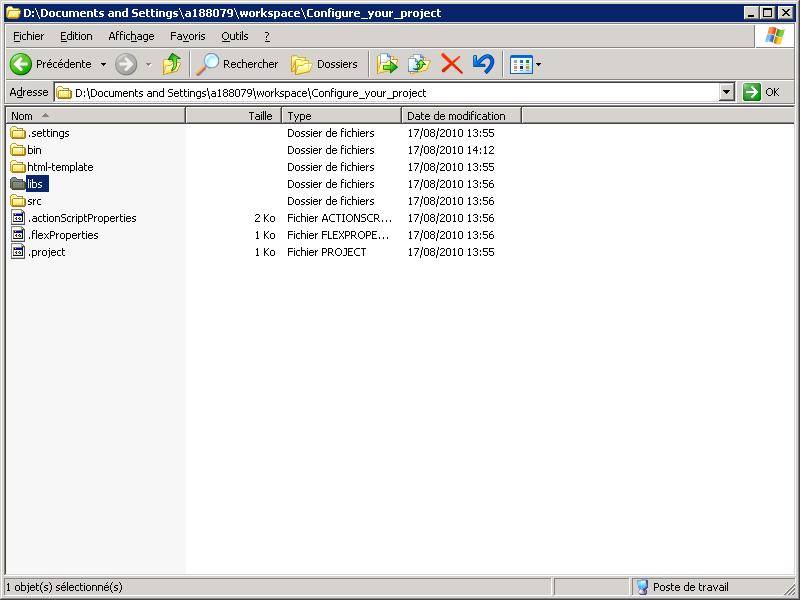

Tutorial 1 : Configure your first project
=========================================

Prerequisites
-------------

Before beginning this tutorial, you need to have a valid flash builder environment (standalone version or eclipse+plugin)

For more information, go to http://www.adobe.com/products/flashbuilder/

Configure your environment
--------------------------

Run your FlashBuilder environment.
Create a new Flex project.

Configure the project
---------------------

Give a name to your project.

Choose the application type wished (web or desktop).

Select the SDK version (at least Flex 4.0).

Note the path where your project will be stored.

Click on the next button.

Change the name of the output folder if needed.

Click on the next button.

Then finish the procedure.

Get OpenScales librairies
-------------------------

Go to http://bitbucket.org/gis/openscales/downloads/openscales-1.2.zip to download the latest version of OpenScales.

Extract files
-------------

Extract only the four files contained in the libs folder, with the .swc extension and put it into the libs folder present in your workspace.
In your FlashBuilder environment, refresh your project (F5).

Here you are
------------

Right now, you’re able to start developing your OpenScales based application.
