Tutorial 2 : Create your first map
==================================

Prerequisites
-------------

This tutorial begins where :doc:`tutorial1` left off.

What do you obtain with this tutorial?
--------------------------------------

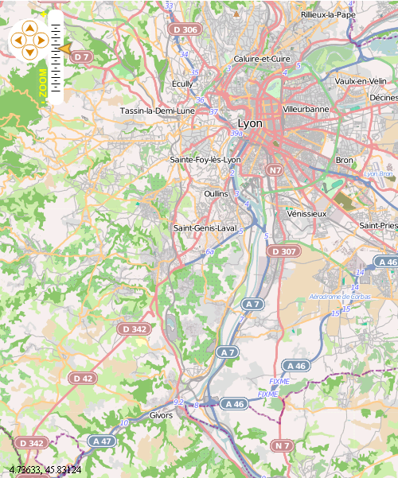

Code to obtain the map
----------------------

.. code-block:: mxml

	<?xml version="1.0" encoding="utf-8"?>
	<s:Application xmlns:fx="http://ns.adobe.com/mxml/2009" 
			xmlns:s="library://ns.adobe.com/flex/spark" 
			xmlns:mx="library://ns.adobe.com/flex/mx"
			minWidth="955"
			minHeight="600"
			xmlns:os="http://openscales.org"
			creationComplete="initMap();">
		
		<fx:Declarations>
		</fx:Declarations>
		
	<os:Map id="fxmap"
		width="500"
		height="600"
		zoom="11"
		center="4.78783,45.68800"
		x="60"
		y="50">
		<os:Mapnik name="Mapnik"/>
		<os:MousePosition x="10"
			y="{fxmap.height-20}"
			displayProjection="EPSG:4326"/>
		<os:DragHandler/>
		<os:ClickHandler/>
		<os:WheelHandler/>
	</os:Map>
	<os:PanZoom map="{map}"
		x="{fxmap.x+10}"
		y="{fxmap.y+10}"/>

	<fx:Script>
		<![CDATA[
			import org.openscales.core.Map;
			import org.openscales.core.feature.PointFeature;
			import org.openscales.core.layer.FeatureLayer;
			import org.openscales.core.style.Style;
			import org.openscales.geometry.Point;
			import org.openscales.proj4as.ProjProjection;
			import org.openscales.core.feature.CustomMarker;
			
			[Bindable] private var map:Map = null;
			private function initMap():void {
				map = fxmap.map;
			}
		]]>
	</fx:Script>
		
	</s:Application>
	
The .mxml file at the beginning
-------------------------------
.. code-block:: mxml

	<?xml version="1.0" encoding="utf-8"?>
	<s:Application xmlns:fx="http://ns.adobe.com/mxml/2009" 
		   xmlns:s="library://ns.adobe.com/flex/spark" 
		   xmlns:mx="library://ns.adobe.com/flex/mx"
		   minWidth="955"
		   minHeight="600">
		<fx:Declarations>
		</fx:Declarations>
	</s:Application>
	
Add a namespace
---------------
.. code-block:: mxml

	<?xml version="1.0" encoding="utf-8"?>
	<s:Application xmlns:fx="http://ns.adobe.com/mxml/2009" 
		   xmlns:s="library://ns.adobe.com/flex/spark" 
		   xmlns:mx="library://ns.adobe.com/flex/mx"
		   minWidth="955"
		   minHeight="600"
		   xmlns:os="http://openscales.org">
		<fx:Declarations>
		</fx:Declarations>
	</s:Application>

Now, "os" namespace is linked to the OpenScales-fx library.

Create a map
------------

The following source code adds a map to your application.

.. code-block:: mxml

	<os:Map id="fxmap"
		width="500"
		height="600"
		zoom="12"
		center="4.83212,45.75781"
		x="100"
		y="100">
	</os:Map>

* id is the unique identifier of the FxMap (here: fxmap).
* width and height define the size of the map.
* zoom sets the zoom level when the application starts.
* center represents the coordinates where the map will be centered to. They should be in the same projection as the base layer.
* x and y determine the position of the map in the application.

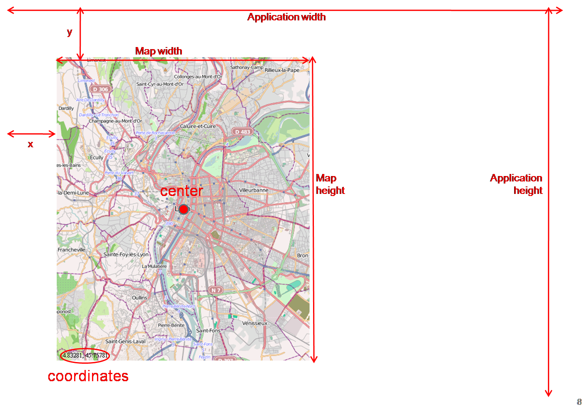

Add an Open Street Map (OSM) layer
----------------------------------

An example of an OSM layer: Mapnik. Just add this code into the <os:Map> tag.

.. code-block:: mxml

	<os:Mapnik name="base"/>

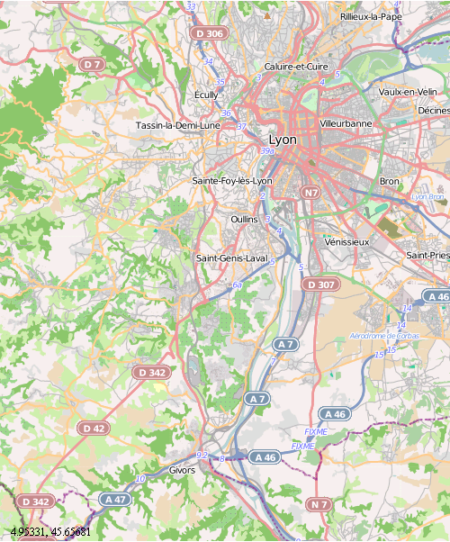
		
Other OSM layers exist : Cycle Map, Osmarender. They are based on OSM data but with other rendering rules.

.. code-block:: mxml

	<os:CycleMap name="base"
		proxy="http://www.openscales.org/proxy.php?url=" />

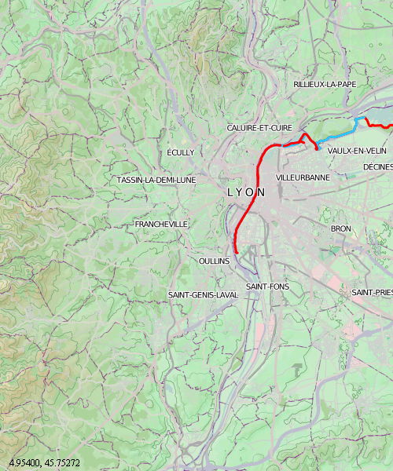

.. code-block:: mxml

	<os:Osmarender name="base"
		proxy="http://www.openscales.org/proxy.php?url=" />

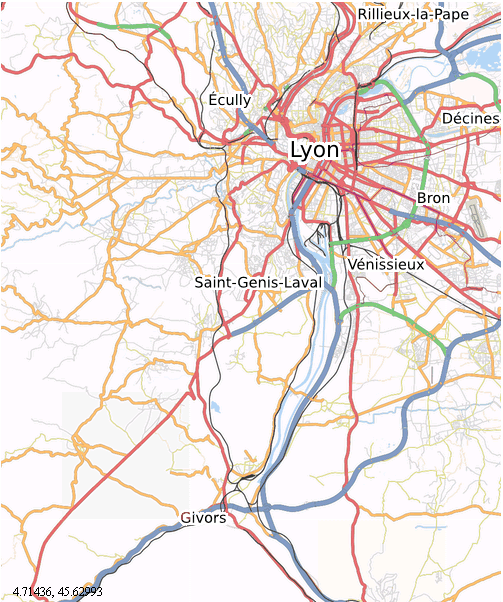

*proxy* parameter is not mandatory but may prevent security errors due to non valid crossdomain policy on the targeted server which is the case with OSM servers.

Example with an OGC layer: Web Feature Service (WFS)
----------------------------------------------------

The Open Geospatial Consortium defines several protocols like WFS, WMS ...

You can find many examples with OGC layer in OpenScales-fx-example sources. Here is an example that provides a Web Feature Service layer as a base layer. Replace the previous 2 code lines by these:

.. code-block:: mxml

	<os:WFS name="Topp States (WFS)"
		url="http://openscales.org/geoserver/wfs"
		typename="topp:states"
		projection="EPSG:4326"
		version="1.0.0"
		style="{Style.getDefaultSurfaceStyle()}"/>

Note: Data is located over the USA. To visualise it, change the coordinates of the center Map parameter and set the zoom to 3.

.. code-block:: mxml

	zoom="3"
	center="-100.10929,40.48437"

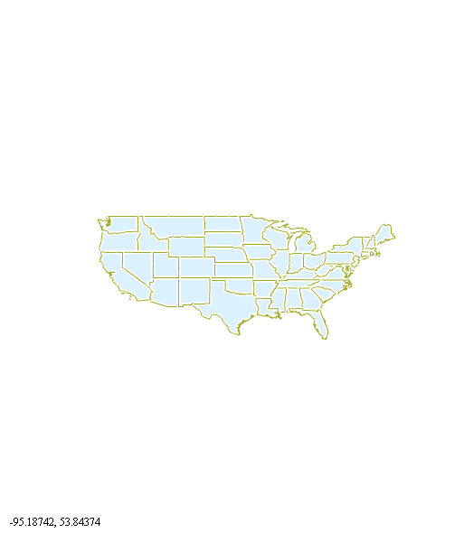

Use several layers in one single map
------------------------------------

Example : add an OSM base layer and a KML layer

.. code-block:: mxml

	<os:Mapnik name="Mapnik"
		proxy="http://openscales.org/proxy.php?url="/>

	<os:KML url="http://code.google.com/intl/fr/apis/kml/documentation/KML_Samples.kml"
		proxy="http://openscales.org/proxy.php?url="
		numZoomLevels="20"
		style="{Style.getDefaultLineStyle()}"/>
			
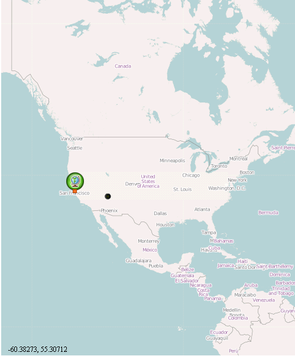
			
The KML layer is not set as a base layer so that it will come over the OSM layer. On the example, Mapnik is the baselayer, and the KML layer is visible thanks to the 3 markers.

IGN (French National Geographic Institute) layers
-------------------------------------------------

OpenScales allows you to use security manager to access one or more layers.
Here is an example with a layer from the French National Geographic Institute (IGN) portal (`IGN <http://geoportail.fr>`_).
It uses an OGC protocol: Wep Map Service - Cached layer.
In order to test IGN maps with you own api key on your personal computer, you have to use a local webserver (apache for instance), and deploy the swf within its webroot. You can then access it at : http://localhost/YourExample.swf
If you can't test on a local web server, you need to upload your swf file on the website declared as referer when you requested your api key.

.. code-block:: mxml

	<os:IGNGeoRMSecurity key="xxxxxxxx"
		  	     method="POST"
			     layers="ORTHOPHOTOS"/>

	<os:WMSC id="ortho"
		 name="ORTHOPHOTOS"
		 url="http://wxs.ign.fr/geoportail/wmsc"
		 layers="ORTHOIMAGERY.ORTHOPHOTOS"
		 format="image/jpeg"
		 resolutions="39135.75,19567.875,9783.9375,4891.96875,2445.984375,2048,1024,512,256,128,64,32,16,8,4,2,1,0.5,0.25,0.125,0.0625"
		 projection="IGNF:GEOPORTALFXX"
		 minZoomLevel="5"
		 maxZoomLevel="17"
		 maxExtent="-1048576,3670016,2097152,6815744"
		 exceptions="text/xml"
		 method="POST"/>
		 
Note: Data is located over France. To visualise it, change the coordinates of the center Map parameter and set the zoom to 10.

.. code-block:: mxml

	zoom="5"
	center="-0.14908,46.99964"
	
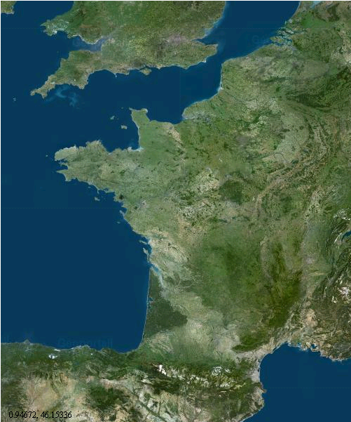

Add the coordinates of the mouse position
-----------------------------------------

Coordinates are displayed in the specific system of projection that you want to use. In the following example (add it into the <os:Map> tag) the projection used is the EPSG:4326 (http://spatialreference.org/ref/epsg/4326/).
x and y are the position (in pixel) where the coordinates will be displayed on the map.

.. code-block:: mxml

	<os:MousePosition x="10"
		y="{fxmap.height-20}"
		displayProjection="EPSG:4326"/>

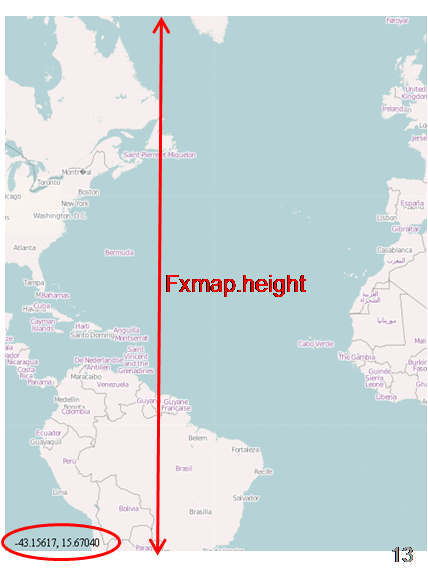
		   
Add mouse controls
------------------

Several mouse controls are available:

* zoom using mouse wheel (WheelHandler)
* various controls with the click (ClickHandler)
* Move the map using drag and drop (DragHandler)

This will allow you to move the map, clic, zoom with the mouse wheel. They should be inserted into <os:Map> tag.

.. code-block:: mxml

	<os:DragHandler/>
	<os:ClickHandler/>
	<os:WheelHandler/>
	
Add navigation tools
--------------------

To display the navigation tools, you have to insert the following code after the </os:Map> tag.

This example adds a pan tool and a zoom slider.

.. code-block:: mxml

	<os:PanZoom map="{map}"
		x="{fxmap.x+10}"
		y="{fxmap.y+10}"/>

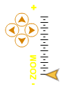
		
Warning : this requires a small Action Script code :

Add the needed Action Script code for the navigation tools
----------------------------------------------------------

After the </os:PanZoom> tag, add:

.. code-block:: mxml

	<fx:Script>
		<![CDATA[
			import org.openscales.core.Map;

			[Bindable] private var map:Map = null;
			private function initMap():void {
				map = fxmap.map;
			}
		]]>
	</fx:Script>

We find:

* fxmap: the identifier of the FxMap seen when you create a map
* The initialization of map for the navigation tools

You also have to specify that initMap() function has to be called when the application is ready:

.. code-block:: mxml

	<s:Application xmlns:fx="http://ns.adobe.com/mxml/2009" 
		xmlns:s="library://ns.adobe.com/flex/spark" 
		xmlns:mx="library://ns.adobe.com/flex/mx"
		minWidth="955"
		minHeight="600"
		xmlns:os="http://openscales.org"
		creationComplete="initMap();">

How to launch the Flash application
-----------------------------------

Click on the *player* icon of your flash builder environment to launch your application.

In the Run as window, choose Web application or Desktop Application, depending on what you choose when you configured your project.

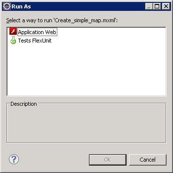

Here you are
------------

Right now, you're able to start building your OpenScales maps.
