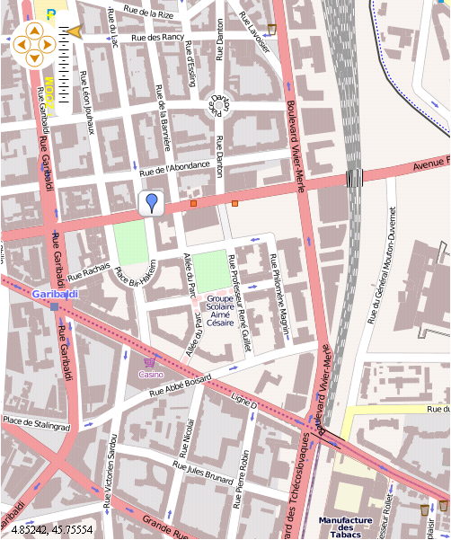

Tutorial 3 : Add markers
==================================

Prerequisites
-------------

This tutorial begins where :doc:`tutorial2` left off.

What do you obtain with this tutorial?
--------------------------------------

Action Script code to obtain the map
------------------------------------

.. code-block:: as3

	<fx:Script>
        <![CDATA[
            import org.openscales.basetypes.Location;
            import org.openscales.core.Map;
            import org.openscales.core.feature.CustomMarker;
            import org.openscales.core.feature.PointFeature;
            import org.openscales.core.layer.FeatureLayer;
            import org.openscales.core.style.Style;
            import org.openscales.geometry.Point;
            import org.openscales.proj4as.ProjProjection;
            
            [Bindable] private var map:Map = null;
            private function initMap():void {
                map = fxmap.map;
                var markers:FeatureLayer = new FeatureLayer("NameOfYourLayerWithMarkers");
                markers.projection = new ProjProjection("EPSG:4326");
                markers.generateResolutions(19);
                markers.style = Style.getDefaultPointStyle();
                
                //add the first marker
                var marker:PointFeature = PointFeature.createPointFeature(new Location(4.85680,45.75336));
                markers.addFeature(marker);
                
                //add a second marker
                marker = PointFeature.createPointFeature(new Location(4.85780,45.75336));
                markers.addFeature(marker);
                
                //add marker with different symbol, writing url address
                markers.addFeature(CustomMarker.
                    createUrlBasedMarker("http://earth.google.com/intl/en_uk/outreach/images/add_placemark.png", 
                        new Location(4.85580,45.75336)));
                
                //add the layer
                map.addLayer(markers);
            }
        ]]>
	</fx:Script>
	
Add a default style marker
--------------------------

A marker is created in the Action Script part of the mxml file.

To create a simple marker you need:

* to create a feature layer
* to define the system of projection used by the layer
* to generate the resolutions at which the markers will be visible
* to define the default style
* to create a point with the correct coordinates (same projection as the layer)

.. code-block:: as3

	fx:Script>
        <![CDATA[
            import org.openscales.core.Map;
            import org.openscales.core.feature.PointFeature;
            import org.openscales.core.layer.FeatureLayer;
            import org.openscales.core.style.Style;
            import org.openscales.geometry.Point;
            import org.openscales.proj4as.ProjProjection;
            
            [Bindable] private var map:Map = null;
            private function initMap():void {
                map = fxmap.map;
                var markers:FeatureLayer = new FeatureLayer("NameOfYourLayerWithMarkers");
                markers.projection = new ProjProjection("EPSG:4326");
                markers.generateResolutions(19);
                markers.style = Style.getDefaultPointStyle();
                
                var marker:PointFeature=PointFeature.createPointFeature(new Location(4.85980,45.75336));
                markers.addFeature(marker);
                map.addLayer(markers);
            }
        ]]>
	</fx:Script>

Add another marker
------------------

Write these two lines before adding the layer with

.. code-block:: as3

	map.addLayer(markers);

.. code-block:: as3

	marker = PointFeature.createPointFeature(new Location(4.85980,45.75336));
	markers.addFeature(marker);

Add marker with custom symbol
-----------------------------

.. image:: _static/tuto3-customMarker.png

You can add a symbol from a URL address:
First, add this import next to the others:

.. code-block:: as3

	import org.openscales.core.feature.CustomMarker;

Then, add the marker before adding the layer:

.. code-block:: as3

	markers.addFeature(CustomMarker.createUrlBasedMarker("http://earth.google.com/intl/en_uk/outreach/images/add_placemark.png", new Location(4.85980,45.75336)));

Here you are
------------

Right now, you’re able to add markers to your OpenScales maps.

